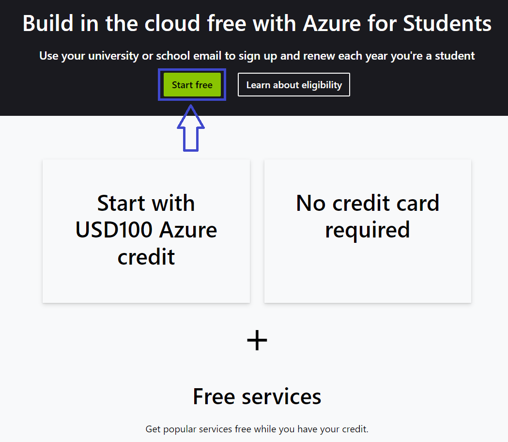
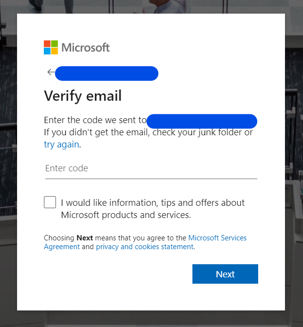
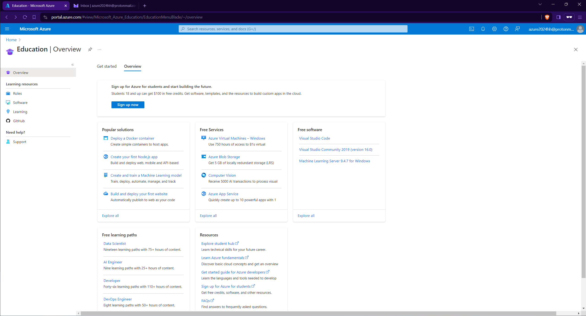
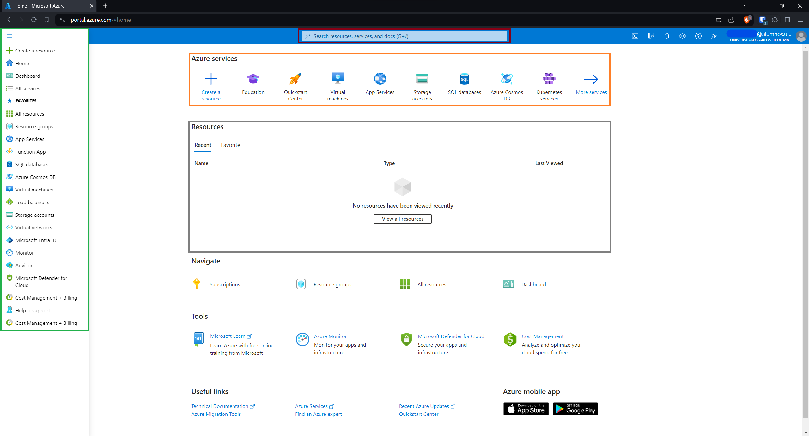
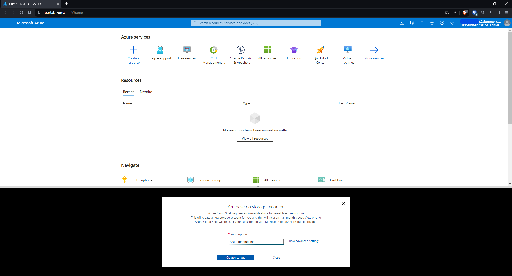
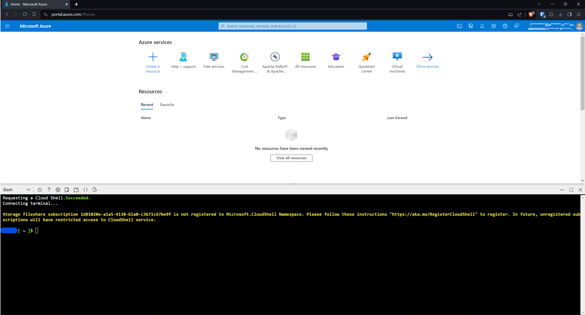
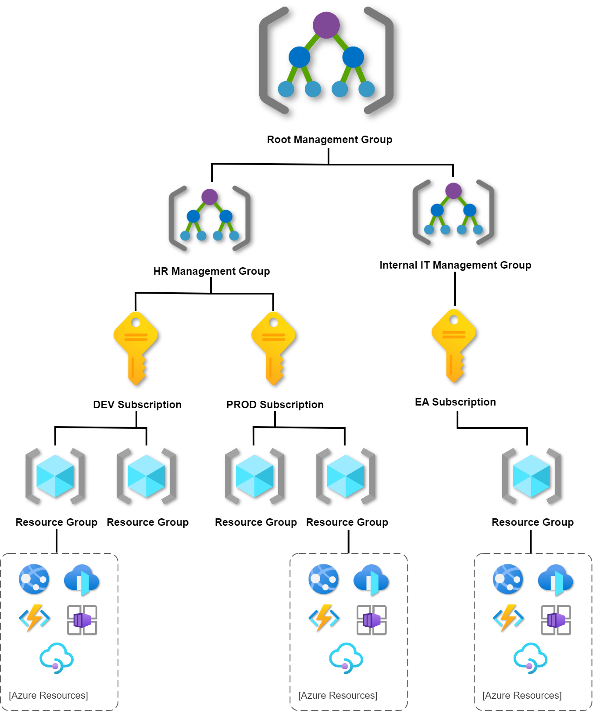
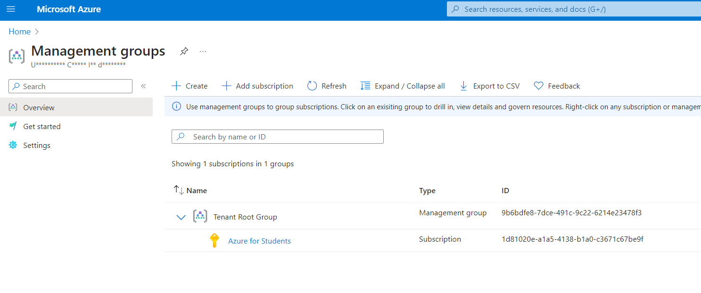
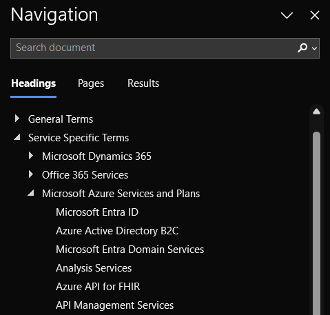

# Introduction to Cloud Computing

## Cloud Computing and Virtualization

The technology that lies at the core of all cloud operations is virtualization. As illustrated in the image below, virtualization lets you divide the hardware resources of a single physical server into smaller units. That physical server could therefore host multiple virtual machines (VMs) running their own complete operating systems, each with its own memory, storage, and network access.

<p align="center">
  
</p>

Virtualization’s flexibility makes it possible to provision a virtual server in a matter of seconds, run it for exactly the time your project requires, and then shut it down. The resources released will become instantly available to other workloads.

#### Is Azure secure?

---

**Q: Why is Azure considered a secure cloud platform?**

**A:** Azure prioritizes security through a multi-layered approach that encompasses physical security, network security, identity and access management, data encryption, and compliance certifications. Microsoft invests heavily in security measures, employs advanced threat intelligence, and regularly updates its security protocols to address emerging threats.

**Q: How does Azure ensure the physical security of its data centers?**

**A:** Azure data centers are equipped with state-of-the-art security features, including strict access controls, surveillance systems, and biometric authentication. Only authorized personnel have access to the physical infrastructure, and security measures are implemented 24/7 to safeguard against unauthorized entry or tampering.

**Q: What measures does Azure take to protect data during transmission?**

**A:** Azure uses industry-standard encryption protocols to secure data in transit. Data transmitted between users and Azure services is encrypted using protocols like HTTPS, ensuring that even if intercepted, the data remains secure. Additionally, Azure offers Virtual Private Network (VPN) and ExpressRoute options for private, dedicated connections.

**Q: How does Azure manage identity and access control?**

**A:** Azure employs robust identity and access management solutions such as Azure Entra ID. Users can implement multi-factor authentication, role-based access control (RBAC), and conditional access policies to control and monitor access to resources, reducing the risk of unauthorized access.

**Q: In what ways does Azure protect data at rest within its services?**

**A:** Azure provides built-in encryption for data at rest, ensuring that stored information remains secure. Azure Storage services, databases, and virtual machines all support encryption mechanisms. Customers can also bring their encryption keys or use Azure Key Vault for centralized key management.

**Q: How does Azure comply with regulatory standards to ensure data privacy and protection?**

**A:** Azure complies with a wide range of international and industry-specific compliance standards, including ISO 27001, GDPR, HIPAA, and many more. Regular audits and certifications validate Azure's adherence to these standards, providing customers with assurance that their data is handled in accordance with regulatory requirements.

**Q: What role does Azure play in helping customers recover from data loss or disasters?**

**A:** Azure offers robust backup and disaster recovery solutions. Services like Azure Backup and Azure Site Recovery enable customers to create comprehensive backup strategies and implement disaster recovery plans. This ensures data availability and minimizes downtime in the event of unexpected incidents.

**Q: How can Azure help organizations monitor and respond to security threats in real-time?**

**A:** Azure Security Center provides continuous monitoring of cloud resources and offers advanced threat detection capabilities. It uses machine learning and behavioral analytics to identify and respond to potential security threats, providing insights and recommendations to enhance overall security posture.

**Q: Can Azure customers have confidence in the privacy of their data?**

**A:** Yes, Azure is committed to respecting customer privacy. Microsoft's data handling practices prioritize customer control and transparency. Azure's privacy controls, coupled with adherence to strict privacy policies, empower customers to manage their data securely within the Azure environment.

Of course there is a caveat here, Azure is as secure also how good practices are implemented by users, here is where the shared responsability model comes in.

The shared responsibility model is a security framework that defines the responsibilities of both cloud service providers and customers in ensuring the security of data and applications in the cloud. In this model, the provider manages security "of" the cloud infrastructure, while the customer is responsible for security "in" the cloud, including data protection, access management, and application security.

Example: In a cloud computing environment, the provider (Azure) is responsible for securing the physical infrastructure, network, and hypervisor, while the customer is responsible for securing their data, configuring access controls, and ensuring the security of applications deployed on the cloud platform.

It will not work if only one of the sides adopts good practices, there is no point in using encryption, securing resources and so on if we simply use an administrator account  with password 1234 without 2FA.

### Azure services overview

Microsoft Azure offers a wide range of services across various categories, including computing, storage, databases, networking, artificial intelligence (AI), Internet of Things (IoT), analytics, and more. Keep in mind that Azure regularly updates its services, introduces new ones, and may retire or modify existing ones. Here's an overview of some key Azure services:


1. **Azure Virtual Machines (VMs):** Allows you to deploy and manage virtualized Windows and Linux servers in the cloud.

2. **Azure Blob Storage:** Provides scalable object storage for large amounts of unstructured data, such as documents and images.

3. **Azure SQL Database:** A fully managed relational database service with high availability and scalability.

4. **Azure App Service:** A platform for building, deploying, and scaling web apps. It supports multiple programming languages.

5. **Azure Kubernetes Service (AKS):** Simplifies the deployment, management, and scaling of containerized applications using Kubernetes.

6. **Azure Functions:** Enables serverless computing, allowing you to run code in response to events without provisioning or managing servers.

7. **Azure Entra ID:** A cloud-based identity and access management service for securing applications and resources.

8. **Azure Virtual Network:** Allows you to create private, isolated, and securely connected networks in the Azure cloud.

9. **Azure IoT Hub:** A fully managed service for securely connecting, monitoring, and managing IoT devices.

10. **Azure DevOps Services:** Provides a set of development tools for version control, build automation, release management, and more.

### Azure Datacenter Architecture

Azure is structured into regions, defined as geographic areas housing one or more data centers. These regions are intricately interconnected through the Microsoft network, hostinga robust and expansive computing environment.

##### Regions

---

Azure regions are geographical areas containing one or more data centers that are connected through a low-latency network. Microsoft Azure, the cloud computing platform provided by Microsoft, is distributed globally across multiple regions to ensure high availability, fault tolerance, and scalability for its services. Each Azure region is designed to be independent of other regions, providing isolation in terms of data residency, compliance, and disaster recovery.

Here are key aspects of Azure regions:

1. **Geographical Distribution:**
   
   - Azure regions are spread across the world to cater to the diverse needs of customers and comply with regional regulations regarding data residency and compliance.
   - Microsoft strategically selects locations for regions based on factors like proximity to customers, data sovereignty requirements, and geopolitical considerations.

2. **Availability Zones:**
   
   - Each Azure region is typically divided into multiple Availability Zones, which are essentially separate data centers within the region.
   - Availability Zones are designed to provide redundancy and resiliency, ensuring that if one zone experiences an outage, the others can continue to operate independently.

3. **Data Centers:**
   
   - Within each region, there are multiple data centers that house the physical infrastructure, including servers, storage, and networking equipment.
   - These data centers are equipped with advanced security measures, backup power supplies, and environmental controls to ensure the safety and integrity of the hosted services.

4. **Network Connectivity:**
   
   - Azure regions are connected through Microsoft's global network infrastructure. This network is designed to provide low-latency, high-bandwidth connectivity between regions, ensuring fast and reliable data transfer.

5. **Service Availability:**
   
   - Azure services are deployed in individual regions, and users can deploy their applications and resources in the region of their choice.
   - Microsoft aims to provide high availability for its services by distributing them across multiple regions and Availability Zones.

6. **Data Residency and Compliance:**
   
   - Azure regions enable users to store their data in specific geographic locations, helping them comply with data residency requirements and regulations in different regions.
   - Microsoft provides a wide range of compliance certifications and adheres to industry-standard security and privacy practices.

7. **Disaster Recovery:**
   
   - The geographic distribution of Azure regions facilitates disaster recovery planning. Users can replicate their applications and data across regions to ensure business continuity in case of a regional outage.

8. **Expanding Footprint:**
   
   - Microsoft continues to expand its Azure footprint by adding new regions globally. This expansion allows customers to deploy their services closer to end-users and comply with specific regional requirements.

Feel free to visit an interactive map of Azure Datacenters

```
https://datacenters.microsoft.com/globe/explore
```

#### Availability zones

---

Many Azure regions provide *availability zones*, which are separated groups of datacenters within a region. Availability zones are close enough to have low-latency connections to other availability zones. They're connected by a high-performance network with a round-trip latency of less than 2ms. However, availability zones are far enough apart to reduce the likelihood that more than one will be affected by local outages or weather. Availability zones have independent power, cooling, and networking infrastructure. They're designed so that if one zone experiences an outage, then regional services, capacity, and high availability are supported by the remaining zones. They help your data stay synchronized and accessible when things go wrong.

Datacenter locations are selected by using rigorous vulnerability risk assessment criteria. This process identifies all significant datacenter-specific risks and considers shared risks between availability zones.

The following diagram shows several example Azure regions. Regions 1 and 2 support availability zones.


#### Azure Global networks

---

Microsoft owns and operates one of the largest backbone networks in the world. This global and sophisticated architecture, spanning more than 165,000 miles, connects our datacenters and customers.

Every day, customers around the world connect and pass trillions of requests to Microsoft Azure, Bing, Dynamics 365, Microsoft 365, XBox, and many others. Regardless of type, customers expect instant reliability and responsiveness from our services.

The [Microsoft global network](https://azure.microsoft.com/global-infrastructure/global-network/) (WAN) is a central part of delivering a great cloud experience. The global network connects our Microsoft [data centers](https://azure.microsoft.com/global-infrastructure/) across 61 Azure regions with a large mesh of edge-nodes strategically placed around the world. The Microsoft global network offers both the availability, capacity, and the flexibility to meet any demand.


<details> 
  <summary>How to access Azure as a Student</summary>

---

Before proceeding, please ensure that you have logged out of any accounts linked to your computer. It is advisable to use private browsing mode in order to avoid account mistakes. 

&nbsp;

1- Click in the link to access Azure for Students.

```
https://azure.microsoft.com/en-gb/free/students/
```

&nbsp;

2- Sign in into microsoft website and click Start free.



&nbsp;

3- Click to create a new account if you do not have one. Please DO NOT use your academic email here, it is possible that your institution already set up a tenant in Azure and you will not be able to perform actions on the Azure Active Directory or the so called Entra ID.


&nbsp;

Do NOT use your academic email in the account creation step. This step is crucial.


&nbsp;

4- Fill the details of location and date of birth.


&nbsp;

5- After filling out the registration form, proceed to verify your email address. Check your inbox for a verification message and follow the provided instructions to confirm your registration. This step is essential to ensure the security and validity of your account.



&nbsp;

6- Complete the necessary information in the registration form, and be sure to replace the "School Name" with the name of your educational institution. Also the institutional email.


&nbsp;

7- Set up your Azure profile as a student and receive the 100\$ voucher, simply complete the form. Ensure that you provide accurate and valid information during the registration. Once the form is submitted, the system will automatically load it in your account. This voucher can be used for various Azure services, allowing you to explore and utilize Microsoft's cloud platform for educational purposes.


&nbsp;

8- Congratulations on successfully creating your first Azure account! This marks the beginning of your journey into Microsoft's cloud platform.


&nbsp;

*If you face any issues in the voucher retrieval, like an endless loop or broken redirects please go to this link and log-in directly type education in the search bar and go to the education overview:

```
https://portal.azure.com/
```

If there is credits in USD or EUR in the overview page you are ready to go.

If not, try to repeat the steps mentioned above until you complete all the dialogs by clicking in sign up now.



&nbsp;

There should be a prompt like this after clicking sign up now.


</details>

<details> 
  <summary>Basic navigation</summary>

---

Upon completing the registration, you will be presented with an overview of the Azure Education platform, along with details about the credits you have redeemed. Check that before continuing.


After reviewing the Azure Education overview, you can easily navigate to the Azure homepage by clicking on the Microsoft Azure logo located in the top right side bar. This will take you to the main dashboard, where you can access various services, resources, and manage your account settings.



As you can see the Azure homepage provides multiple ways to access services. The left-side dropdown menu, where favorite services can be pinned, offers a convenient and quick navigation option. Additionally, the search bar allows you to find and access any service efficiently by entering keywords. Whether through the dropdown menu, search bar, or other elements on the homepage they serve a similar porpuse which is to access resources.

We have a set of prompt buttons positioned in the upper right corner:


1. **Cloud Shell:** Allows users to run commands and scripts directly from the Azure portal without local installations. It provides a command-line interface with pre-installed tools, making resource management, task execution, and scripting convenient.

2. **Directories + Subscription (deprecated):** Formerly used for managing directories and subscriptions, this feature is now deprecated. You can find it now in Settings.

3. **Notifications:** Users can monitor important updates, alerts, and events related to their Azure resources in real-time. Notifications help users stay informed and take timely actions based on critical changes.

4. **Settings:** Enables users to customize their Azure portal experience by configuring various settings. Users can adjust preferences, personalize their dashboard, and modify interface settings.

5. **Support:** Provides a direct pathway for users to connect with Azure support services. Users can seek technical assistance, submit support tickets, and explore additional support options to address any issues or queries encountered during Azure usage.

6. **Feedback:** Interface to send feeback about Azure.

Feel free to click in more services or all services in order to get a quick overview of all the services available.


Also you can try typing free services in the search bar.


The Azure Free Tier is a program by Microsoft Azure that allows users to explore and use a limited amount of Azure services for free. It's an excellent way for individuals, developers, and small businesses to get hands-on experience with Azure without incurring costs.

</details>

<details> 
  <summary>Azure Cloud Shell</summary>

---

Azure Cloud Shell is an interactive and authenticated terminal accessible from a web browser for managing Azure resources. It provides the flexibility to choose between the Bash or PowerShell shell experiences based on individual preferences and familiarity.

The Cloud Shell environment runs on a temporary host assigned to each session and user. A Cloud Shell session has a timeout period of 20 minutes without interactive activity, after which it automatically closes. Additionally, Cloud Shell offers persistent storage in Azure through a 5 GB file share, allowing users to retain files and configurations across sessions.

Microsoft manages Cloud Shell, relieving users from the burden of administration. Cloud Shell incorporates popular command-line tools and supports various programming languages. It securely and automatically authenticates to provide immediate access to resources using the Azure CLI or Azure PowerShell cmdlets. You can refer to the list of installed tools in Cloud Shell for a comprehensive overview.

&nbsp;

1- Click on Cloud Shell icon


&nbsp;

2- Click on create storage



&nbsp;

3- Wait until Cloud Shell is ready



In this particular practice, a dual approach to deployment has been chosen. Cloud Shell will be employed for certain components, leveraging its command-line capabilities, while the graphical user interface (GUI) will be utilized for other specific tasks so you will learn both ways.

</details>

<details> 
  <summary>Azure Resource Hierarchy</summary>

---

Before proceeding further, it is essential to have a basic understanding of the Azure resource hierarchy. This involves gaining a foundational understanding of how different resources are organized and interconnected within the Azure environment.

But first some definitions of basic concepts:

**Azure Active Directory:** Is Microsoft's cloud-based identity and access management service. Azure Active Directory is designed to help organizations manage and secure user identities and access to applications and resources in the cloud. Nowadays is renamed to Azure Entra ID.

&nbsp;



&nbsp;

1. **Management Groups**

At the top level of the hierarchy are **management groups**. Management groups provide a way to manage access, policies, and compliance for multiple subscriptions. They help in organizing subscriptions based on organizational structure or business divisions. Policies can be applied at the management group level to enforce governance standards across multiple subscriptions. A management group tree can support up to six levels of depth however this limit doesn’t include root or subscription level.

2. **Subscriptions**

Below management groups are **subscriptions**, which represent an agreement with Microsoft to use Azure services. Subscriptions are used to organize and manage resources such as virtual machines, databases, and storage accounts. Organizations often have multiple subscriptions to separate environments like development, testing, and production.

3. **Resource Groups**

Within a subscription, resources are organized into **resource groups**. A resource group is a logical container for resources, and it helps in managing and organizing resources based on their lifecycle, ownership, or environment. Resources within a resource group share the same lifecycle and are deployed, updated, and deleted together.

4. **Resources**

At the lowest level of the hierarchy are individual **resources**. These are the actual services or components you deploy, such as virtual machines, databases, storage accounts, etc. Resources are always associated with a resource group.

&nbsp;

In our case, if we access the management groups:



&nbsp;

We can check that there is the tenant root group, which in turn is assigned to our Azure for Students subscription containing the credits we will utilize for conducting our laboratory.

Each Microsoft Entra tenant is given a single top-level management group called the root management group. This root management group is built into the hierarchy to have all management groups and subscriptions fold up to it. This group allows global policies and Azure role assignments to be applied at the directory level.

</details>

<details> 
  <summary>SLAs and Pricing </summary>

A. What is an SLA?
Service Level Agreements, or SLAs, are the backbone of trust between cloud service providers and customers. They define the minimum levels of service a customer can expect and provide a foundation for accountability and reliability.

```
https://www.microsoft.com/licensing/docs/view/Service-Level-Agreements-SLA-for-Online-Services?lang=1
```

&nbsp;

B. Azure SLA Overview
Azure's SLAs are comprehensive, covering a wide array of services from virtual machines to storage and networking. By understanding the commitments made by Microsoft in these SLAs, organizations can make informed decisions about service selection based on their specific requirements.



&nbsp;
C. SLA Metrics
Azure SLAs commonly include metrics such as uptime percentage, response times, and data durability. It's crucial to grasp how these metrics are measured and reported, as this knowledge empowers organizations to assess the performance and reliability of their Azure services.


&nbsp;

D. Real-world Examples
Let's examine real-world scenarios where adherence to SLAs has been pivotal. Whether it's a critical business application relying on Azure services or a global-scale event stressing cloud infrastructure, understanding how SLAs come into play provides valuable insights into the practical implications of these agreements.

This is an example of an azure architecture with serveral resources, but let's focus only on the Azure SQL databases in this exercise. It doesn't matter that we don't know what a database is, for now we will treat it as a simple service with a contracted agreement.


&nbsp;

Let's calculate the SLA of a single SQL database:

1. **Azure SQL Database SLA (Single Database):**
   - SLA: 99.99% (Check the documentation refered above.)

The formula for calculating downtime is:

Downtime=(1−SLA)×TotalTime

Downtime=(1−0.9999)×43,200 (1 month in minutes)

Downtime=0.0001×43,200

Downtime=4.32minutes

So, for a single Azure SQL Database with a 99.99% SLA, the allowable downtime in a month is 4.32 minutes.

&nbsp;

Let's calculate the SLA of a 2 georedundant SQL database then:

2. **Azure SQL Database with Redundancy (e.g., Geo-Replication):**
   - Assume you have set up geo-replication for your Azure SQL Database to a different region, providing a higher level of redundancy.
   - SLA combined: ? (Check the documentation refered above.)

HIDE*

Now, let's calculate the allowable downtime for the geo-replicated Azure SQL Database:

Downtime=(1−0.99995)×43,200

Downtime=0.00005×43,200

Downtime=2.16minutes

So, with geo-replication in place, the allowable downtime for the Azure SQL Database improves to 2.16 minutes in a month.

HIDE*

&nbsp;

Having covered the essentials of Service Level Agreements (SLAs), it's time to dive into the financial aspect of Azure. Azure operates on a pay-as-you-go model, The "Pay-as-You-Go" model in Microsoft Azure refers to a pricing and billing approach where users pay for the cloud services they consume based on actual usage. This model is designed to provide flexibility and cost-effectiveness, especially for businesses and individuals who may have varying workloads or unpredictable resource requirements. 

This makes really hard to calculate the costs of a service because several variables intervene in the operation, but there is a tool provided that will help us with our estimations.

```
https://azure.microsoft.com/en-gb/pricing/calculator/
```

</details>

Now lets do review the steps to calculate the cost of a service in Azure, which in this case is a virtual machine

&nbsp;

Select Azure Services:
Choose the specific Azure services you plan to use, either by browsing categories or using the search feature.


Configure Services:
For each selected service, configure parameters such as region, virtual machine type, and storage to match your project's requirements.

Adjust Usage Details:
Modify usage details like the number of hours a resource will run, data storage, or transactions processed to reflect your specific needs.

Review Estimate:
The calculator provides a real-time estimate as you configure services. Review it to ensure it aligns with your expectations for monthly costs.


Save or Share the Estimate:
If you have an Azure account, save the estimate for future reference. You can also share it by generating a unique link.

Export as CSV (Optional):
Export the estimate as a CSV file if you need documentation or further analysis.


Using the Azure Pricing Calculator empowers users to make informed decisions about resource allocation and budgeting before deploying services on the Azure platform. This proactive approach helps in optimizing costs and ensuring efficient resource utilization.
