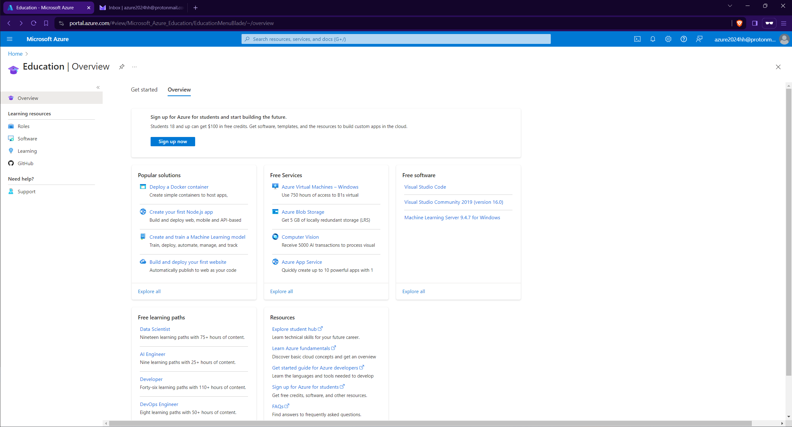
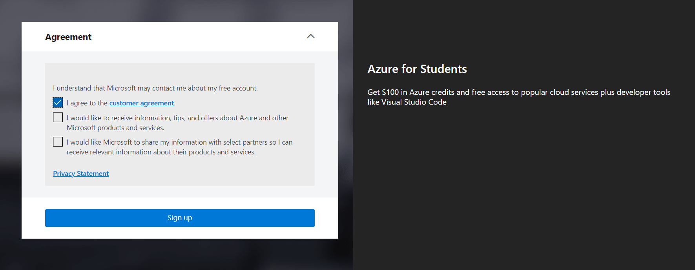

# Account Creation

## How to access Azure as a student

Before proceeding, please ensure that you have logged out of any accounts linked to your computer. It is advisable to use private browsing mode in order to avoid account mistakes. 

&nbsp;

1- Click in the link to access Azure for Students.

```
https://azure.microsoft.com/en-gb/free/students/
```

&nbsp;

2- Sign in into microsoft website and click Start free.

<p align="center">

</p>

3- Click to create a new account if you do not have one. Please DO NOT use your academic email here, it is possible that your institution already set up a tenant in Azure and you will not be able to perform actions on the Azure Active Directory or the so called Entra ID.

<p align="center">

</p>

Do NOT use your academic email in the account creation step. This step is crucial.

<p align="center">

</p>

4- Fill the details of location and date of birth.

<p align="center">

</p>

5- After filling out the registration form, proceed to verify your email address. Check your inbox for a verification message and follow the provided instructions to confirm your registration. This step is essential to ensure the security and validity of your account.

<p align="center">

</p>

6- Complete the necessary information in the registration form, and be sure to replace the "School Name" with the name of your educational institution. Also the institutional email.

<p align="center">

</p>

7- Set up your Azure profile as a student and receive the 100\$ voucher, simply complete the form. Ensure that you provide accurate and valid information during the registration. Once the form is submitted, the system will automatically load it in your account. This voucher can be used for various Azure services, allowing you to explore and utilize Microsoft's cloud platform for educational purposes.

<p align="center">

</p>

<p align="center">

</p>

8- Congratulations on successfully creating your first Azure account! This marks the beginning of your journey into Microsoft's cloud platform.

<p align="center">

</p>

*If you face any issues in the voucher retrieval, like an endless loop or broken redirects please go to this link and log-in directly type education in the search bar and go to the education overview:

```
https://portal.azure.com/
```

If there is credits in USD or EUR in the overview page you are ready to go.

If not, try to repeat the steps mentioned above until you complete all the dialogs by clicking in sign up now.

<p align="center">

</p>

There should be a prompt like this after clicking sign up now.

<p align="center">

</p>

&nbsp;

## Basic navigation

Upon completing the registration, you will be presented with an overview of the Azure Education platform, along with details about the credits you have redeemed. Check that before continuing.

<p align="center">

</p>

After reviewing the Azure Education overview, you can easily navigate to the Azure homepage by clicking on the Microsoft Azure logo located in the top right side bar. This will take you to the main dashboard, where you can access various services, resources, and manage your account settings.

<p align="center">

</p>

As you can see the Azure homepage provides multiple ways to access services. The left-side dropdown menu, where favorite services can be pinned, offers a convenient and quick navigation option. Additionally, the search bar allows you to find and access any service efficiently by entering keywords. Whether through the dropdown menu, search bar, or other elements on the homepage they serve a similar porpuse which is to access resources.

We have a set of prompt buttons positioned in the upper right corner:

<p align="center">

</p>

1. **Cloud Shell:** Allows users to run commands and scripts directly from the Azure portal without local installations. It provides a command-line interface with pre-installed tools, making resource management, task execution, and scripting convenient.

2. **Directories + Subscription (deprecated):** Formerly used for managing directories and subscriptions, this feature is now deprecated. You can find it now in Settings.

3. **Notifications:** Users can monitor important updates, alerts, and events related to their Azure resources in real-time. Notifications help users stay informed and take timely actions based on critical changes.

4. **Settings:** Enables users to customize their Azure portal experience by configuring various settings. Users can adjust preferences, personalize their dashboard, and modify interface settings.

5. **Support:** Provides a direct pathway for users to connect with Azure support services. Users can seek technical assistance, submit support tickets, and explore additional support options to address any issues or queries encountered during Azure usage.

6. **Feedback:** Interface to send feeback about Azure.

Feel free to click in more services or all services in order to get a quick overview of all the services available.

<p align="center">

</p>

Also you can try typing free services in the search bar.

<p align="center">

</p>
The Azure Free Tier is a program by Microsoft Azure that allows users to explore and use a limited amount of Azure services for free. It's an excellent way for individuals, developers, and small businesses to get hands-on experience with Azure without incurring costs.

&nbsp;

## Azure Cloud Shell

Azure Cloud Shell is an interactive and authenticated terminal accessible from a web browser for managing Azure resources. It provides the flexibility to choose between the Bash or PowerShell shell experiences based on individual preferences and familiarity.

The Cloud Shell environment runs on a temporary host assigned to each session and user. A Cloud Shell session has a timeout period of 20 minutes without interactive activity, after which it automatically closes. Additionally, Cloud Shell offers persistent storage in Azure through a 5 GB file share, allowing users to retain files and configurations across sessions.

Microsoft manages Cloud Shell, relieving users from the burden of administration. Cloud Shell incorporates popular command-line tools and supports various programming languages. It securely and automatically authenticates to provide immediate access to resources using the Azure CLI or Azure PowerShell cmdlets. You can refer to the list of installed tools in Cloud Shell for a comprehensive overview.

&nbsp;

1- Click on Cloud Shell icon

<p align="center">

</p>

2- Click on create storage

<p align="center">

</p>

3- Wait until Cloud Shell is ready

<p align="center">

</p>

In this particular practice, a dual approach to deployment has been chosen. Cloud Shell will be employed for certain components, leveraging its command-line capabilities, while the graphical user interface (GUI) will be utilized for other specific tasks so you will learn both ways.
