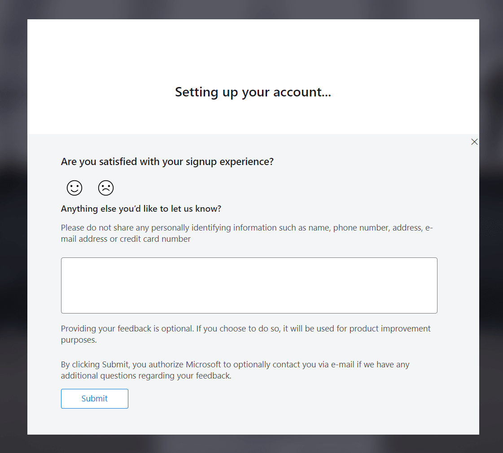

# Account Creation

## How to access Azure as a student

Before proceeding, please ensure that you have logged out of any accounts linked to your computer. It is advisable to use private browsing mode in order to avoid account mistakes. 

&nbsp;

1- Click in the link to access Azure for Students.

```
https://azure.microsoft.com/en-gb/free/students/
```

&nbsp;

2- Sign in into microsoft website and click Start free.

<p align="center">

</p>

3- Click to create a new account if you do not have one. Please DO NOT use your academic email here, it is possible that your institution already set up a tenant in Azure and you will not be able to perform actions on the Azure Active Directory or the so called Entra ID.

<p align="center">

</p>

Do NOT use your academic email in the account creation step. This step is crucial.

<p align="center">

</p>

4- Fill the details of location and date of birth.

<p align="center">

</p>

5- After filling out the registration form, proceed to verify your email address. Check your inbox for a verification message and follow the provided instructions to confirm your registration. This step is essential to ensure the security and validity of your account.

<p align="center">

</p>

6- Complete the necessary information in the registration form, and be sure to replace the "School Name" with the name of your educational institution. Also the institutional email.

<p align="center">

</p>

7- Set up your Azure profile as a student and receive the 100\$ voucher, simply complete the form. Ensure that you provide accurate and valid information during the registration. Once the form is submitted, the system will automatically load it in your account. This voucher can be used for various Azure services, allowing you to explore and utilize Microsoft's cloud platform for educational purposes.

<p align="center">

</p>
<p align="center">

</p>

8- Congratulations on successfully creating your first Azure account! This marks the beginning of your journey into Microsoft's cloud platform.

<p align="center">

</p>

*If you face any issues in the voucher retrieval, like an endless loop or broken redirects please go to this link and log-in directly type education in the search bar and go to the education overview:

```
https://portal.azure.com/
```

If there is credits in USD or EUR in the overview page you are ready to go.

If not, try to repeat the steps mentioned above until you complete all the dialogs by clicking in sign up now.

<p align="center">

</p>

There should be a prompt like this after clicking sign up now.

<p align="center">

</p>

## Basic navigation

## Azure Cloud Shell
