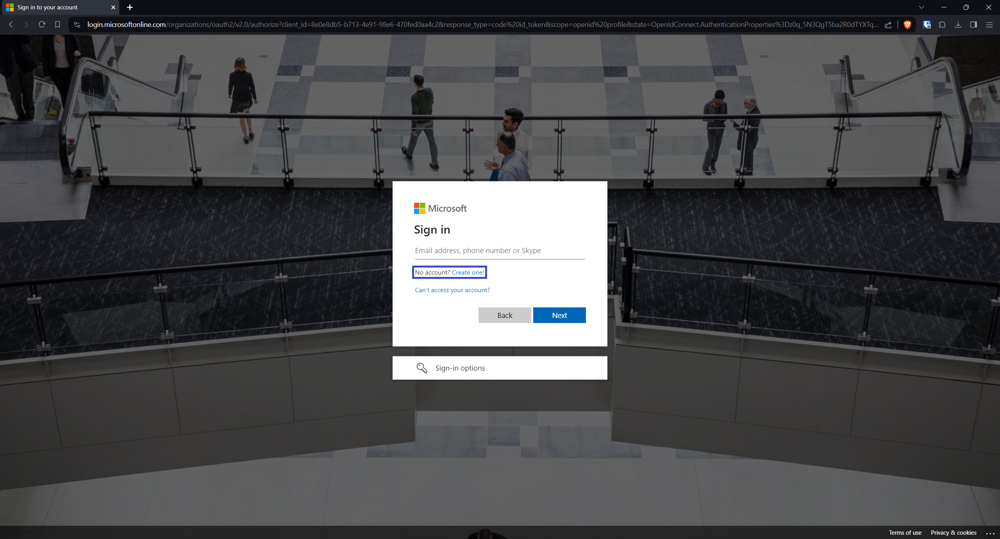
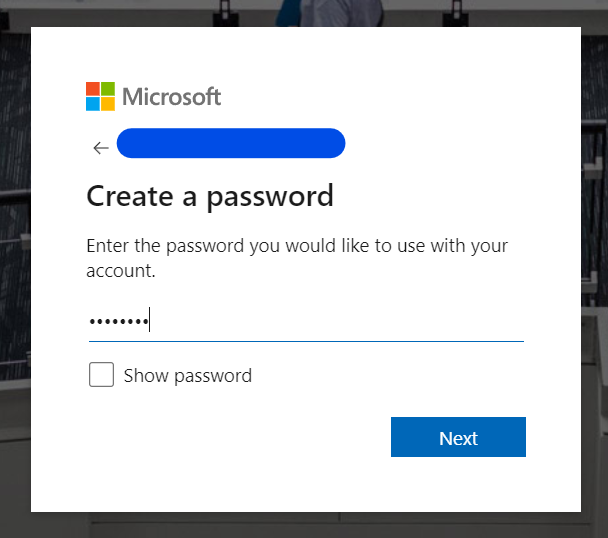
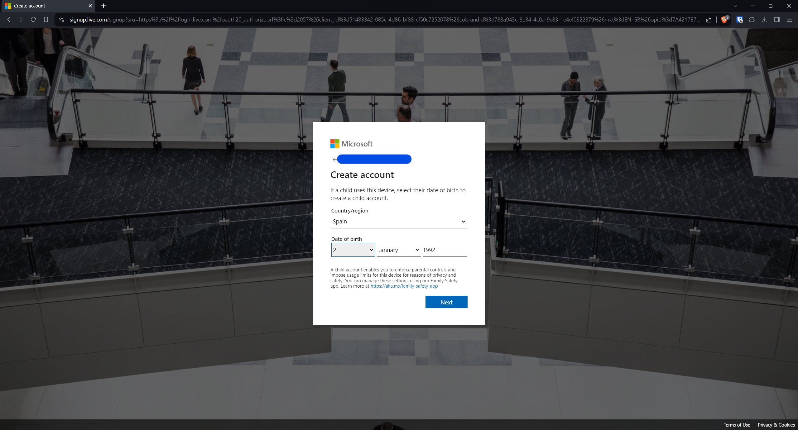
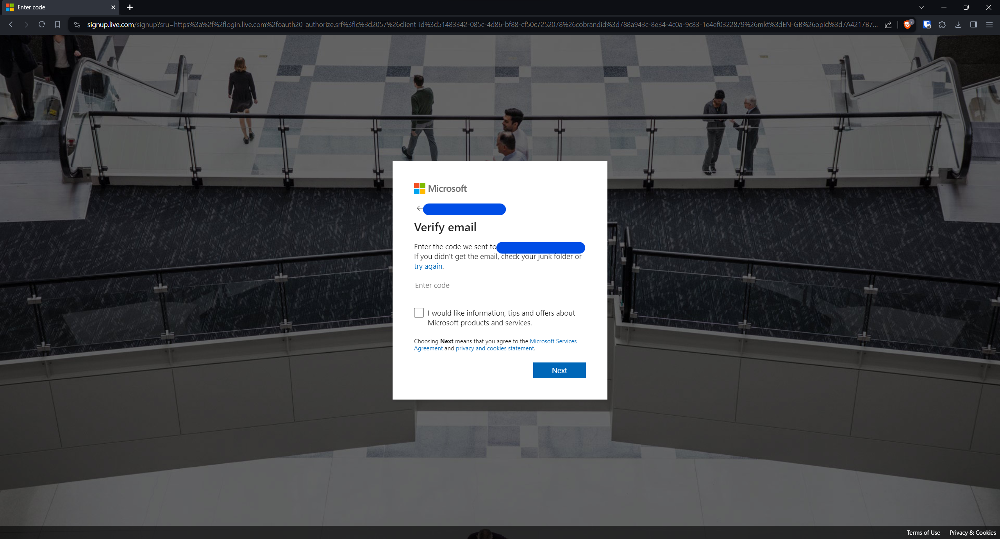
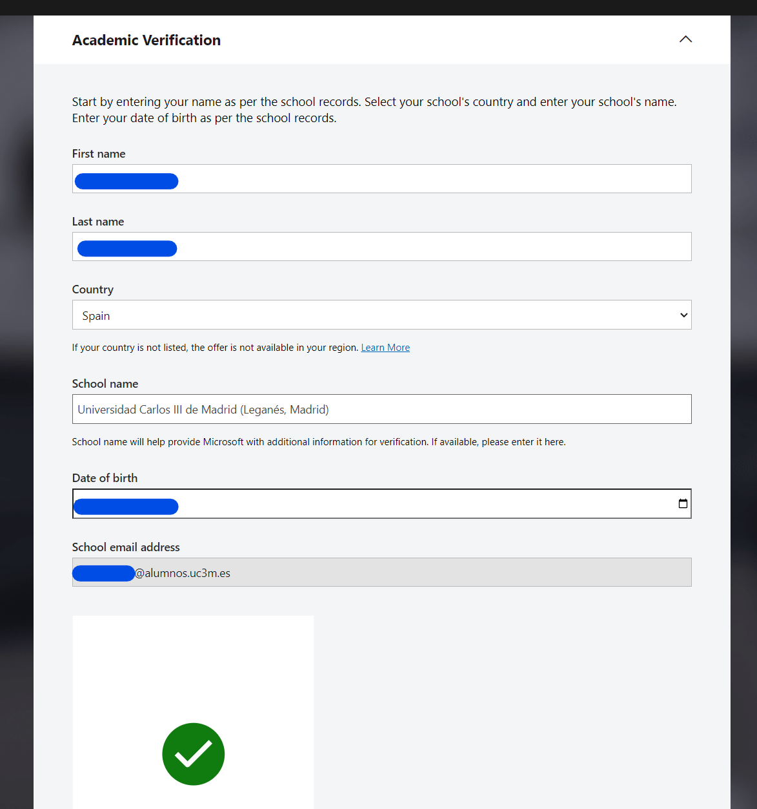
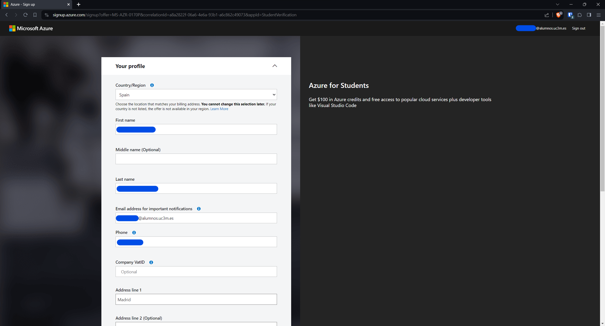
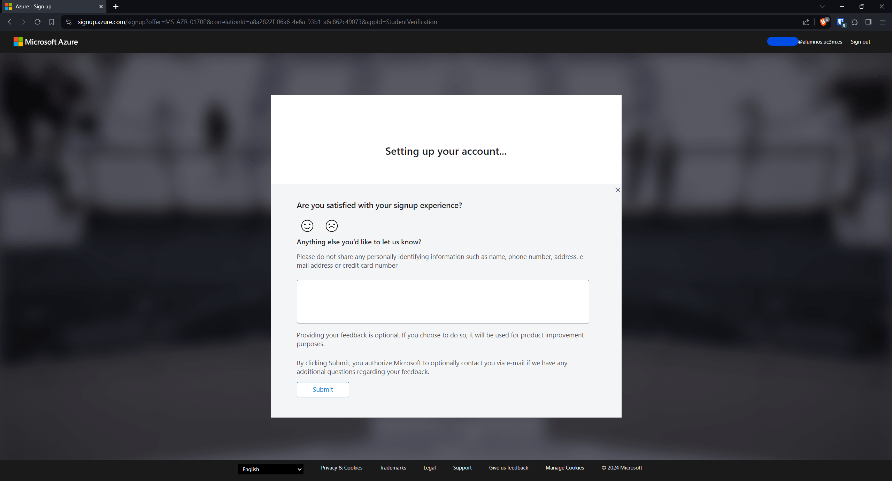
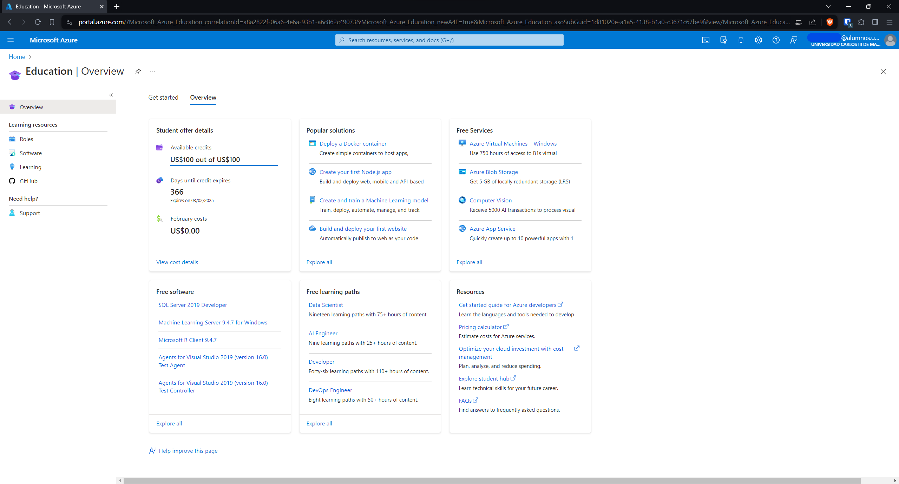

## Introduction

##### Cloud Computing and Virtualization

---

The technology that lies at the core of all cloud operations is virtualization. As illustrated in the image below, virtualization lets you divide the hardware resources of a single physical server into smaller units. That physical server could therefore host multiple virtual machines (VMs) running their own complete operating systems, each with its own memory, storage, and network access.


Virtualization’s flexibility makes it possible to provision a virtual server in a matter of seconds, run it for exactly the time your project requires, and then shut it down. The resources released will become instantly available to other workloads.

<details> 
  <summary>How to access Azure as a Student</summary>

---

1- Click in the link to access Azure for Students.

```
https://azure.microsoft.com/en-gb/free/students/
```

2- Sign in into microsoft website and click Start free.


3- Click to create a new account if you do not have one with you academic email. 



Before proceeding, please ensure that you have logged out of any accounts linked to your computer. It is advisable to use private browsing mode in order to avoid account mistakes. Additionally, during the registration process, make sure to use your academic email for authentication. This step is crucial.



4- Fill the details of location and date of birth.



5- After filling out the registration form, proceed to verify your email address. Check your inbox for a verification message and follow the provided instructions to confirm your registration. This step is essential to ensure the security and validity of your account.



6- Complete the necessary information in the registration form, and be sure to replace the "School Name" with the name of your educational institution. Also the institutional email.



7- Set up your Azure profile as a student and receive the 100\$ voucher, simply complete the form. Ensure that you provide accurate and valid information during the registration. Once the form is submitted, the system will automatically load it in your account. This voucher can be used for various Azure services, allowing you to explore and utilize Microsoft's cloud platform for educational purposes.





8- Congratulations on successfully creating your first Azure account! This marks the beginning of your journey into Microsoft's cloud platform.



</details>
