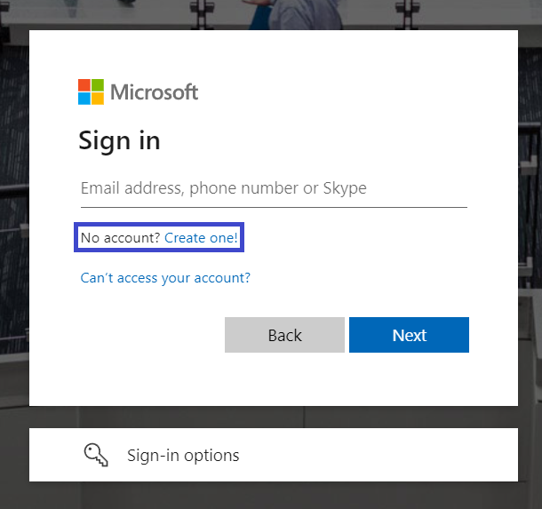

## Introduction

##### Cloud Computing and Virtualization

---

The technology that lies at the core of all cloud operations is virtualization. As illustrated in the image below, virtualization lets you divide the hardware resources of a single physical server into smaller units. That physical server could therefore host multiple virtual machines (VMs) running their own complete operating systems, each with its own memory, storage, and network access.


Virtualization’s flexibility makes it possible to provision a virtual server in a matter of seconds, run it for exactly the time your project requires, and then shut it down. The resources released will become instantly available to other workloads.

<details> 
  <summary>How to access Azure as a Student</summary>

---

1- Click in the link to access Azure for Students.

```
https://azure.microsoft.com/en-gb/free/students/
```

2- Sign in into microsoft website and click Start free.


3- Click to create a new account if you do not have one with you academic email. 



Before proceeding, please ensure that you have logged out of any accounts linked to your computer. It is advisable to use private browsing mode in order to avoid account mistakes. Additionally, during the registration process, make sure to use your academic email for authentication. This step is crucial.


4- Fill the details of location and date of birth.


5- After filling out the registration form, proceed to verify your email address. Check your inbox for a verification message and follow the provided instructions to confirm your registration. This step is essential to ensure the security and validity of your account.


6- Complete the necessary information in the registration form, and be sure to replace the "School Name" with the name of your educational institution. Also the institutional email.


7- Set up your Azure profile as a student and receive the 100\$ voucher, simply complete the form. Ensure that you provide accurate and valid information during the registration. Once the form is submitted, the system will automatically load it in your account. This voucher can be used for various Azure services, allowing you to explore and utilize Microsoft's cloud platform for educational purposes.


8- Congratulations on successfully creating your first Azure account! This marks the beginning of your journey into Microsoft's cloud platform.


</details>

<details> 
  <summary>Basic navigation</summary>

Upon completing the registration, you will be presented with an overview of the Azure Education platform, along with details about the credits you have redeemed. Check that before continuing.


After reviewing the Azure Education overview, you can easily navigate to the Azure homepage by clicking on the Microsoft Azure logo located in the top right side bar. This will take you to the main dashboard, where you can access various services, resources, and manage your account settings.


As you can see the Azure homepage provides multiple ways to access services. The left-side dropdown menu, where favorite services can be pinned, offers a convenient and quick navigation option. Additionally, the search bar allows you to find and access any service efficiently by entering keywords. Whether through the dropdown menu, search bar, or other elements on the homepage they serve a similar porpuse which is to access resources.

We have a set of prompt buttons positioned in the upper right corner:


1. **Cloud Shell:** Allows users to run commands and scripts directly from the Azure portal without local installations. It provides a command-line interface with pre-installed tools, making resource management, task execution, and scripting convenient.

2. **Directories + Subscription (deprecated):** Formerly used for managing directories and subscriptions, this feature is now deprecated. You can find it now in Settings.

3. **Notifications:** Users can monitor important updates, alerts, and events related to their Azure resources in real-time. Notifications help users stay informed and take timely actions based on critical changes.

4. **Settings:** Enables users to customize their Azure portal experience by configuring various settings. Users can adjust preferences, personalize their dashboard, and modify interface settings.

5. **Support:** Provides a direct pathway for users to connect with Azure support services. Users can seek technical assistance, submit support tickets, and explore additional support options to address any issues or queries encountered during Azure usage.

6. **Feedback:** Interface to send feeback about Azure.
   

Feel free to click in more services or all services in order to get a quick overview of all the services available.


Also you can try typing free services in the search bar.


The Azure Free Tier is a program by Microsoft Azure that allows users to explore and use a limited amount of Azure services for free. It's an excellent way for individuals, developers, and small businesses to get hands-on experience with Azure without incurring costs.

</details>
