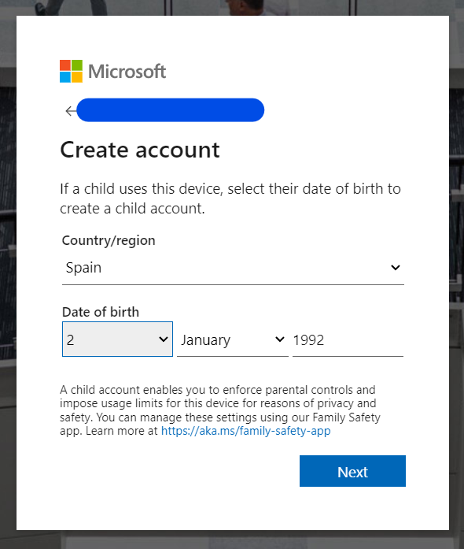
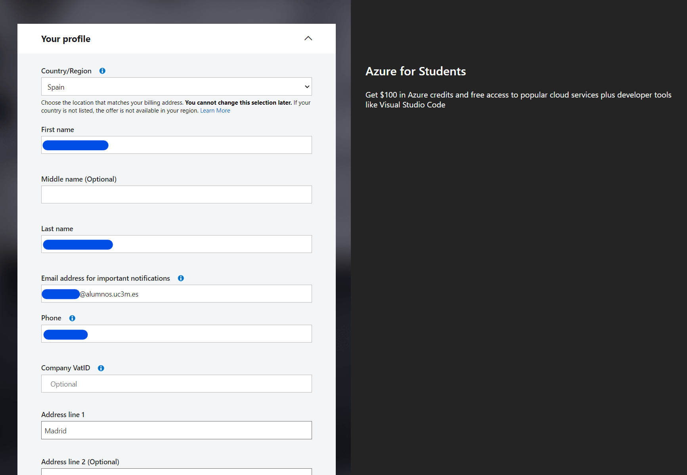

## Introduction

##### Cloud Computing and Virtualization

---

The technology that lies at the core of all cloud operations is virtualization. As illustrated in the image below, virtualization lets you divide the hardware resources of a single physical server into smaller units. That physical server could therefore host multiple virtual machines (VMs) running their own complete operating systems, each with its own memory, storage, and network access.


Virtualization’s flexibility makes it possible to provision a virtual server in a matter of seconds, run it for exactly the time your project requires, and then shut it down. The resources released will become instantly available to other workloads.

<details> 
  <summary>How to access Azure as a Student</summary>

---

1- Click in the link to access Azure for Students.

```
https://azure.microsoft.com/en-gb/free/students/
```

2- Sign in into microsoft website and click Start free.


3- Click to create a new account if you do not have one with you academic email. 


Before proceeding, please ensure that you have logged out of any accounts linked to your computer. It is advisable to use private browsing mode in order to avoid account mistakes. Additionally, during the registration process, make sure to use your academic email for authentication. This step is crucial.


4- Fill the details of location and date of birth.



5- After filling out the registration form, proceed to verify your email address. Check your inbox for a verification message and follow the provided instructions to confirm your registration. This step is essential to ensure the security and validity of your account.


6- Complete the necessary information in the registration form, and be sure to replace the "School Name" with the name of your educational institution. Also the institutional email.


7- Set up your Azure profile as a student and receive the 100\$ voucher, simply complete the form. Ensure that you provide accurate and valid information during the registration. Once the form is submitted, the system will automatically load it in your account. This voucher can be used for various Azure services, allowing you to explore and utilize Microsoft's cloud platform for educational purposes.




8- Congratulations on successfully creating your first Azure account! This marks the beginning of your journey into Microsoft's cloud platform.


</details>

<details> 
  <summary>Basic navigation</summary>

---

Upon completing the registration, you will be presented with an overview of the Azure Education platform, along with details about the credits you have redeemed. Check that before continuing.


After reviewing the Azure Education overview, you can easily navigate to the Azure homepage by clicking on the Microsoft Azure logo located in the top right side bar. This will take you to the main dashboard, where you can access various services, resources, and manage your account settings.


As you can see the Azure homepage provides multiple ways to access services. The left-side dropdown menu, where favorite services can be pinned, offers a convenient and quick navigation option. Additionally, the search bar allows you to find and access any service efficiently by entering keywords. Whether through the dropdown menu, search bar, or other elements on the homepage they serve a similar porpuse which is to access resources.

We have a set of prompt buttons positioned in the upper right corner:


1. **Cloud Shell:** Allows users to run commands and scripts directly from the Azure portal without local installations. It provides a command-line interface with pre-installed tools, making resource management, task execution, and scripting convenient.

2. **Directories + Subscription (deprecated):** Formerly used for managing directories and subscriptions, this feature is now deprecated. You can find it now in Settings.

3. **Notifications:** Users can monitor important updates, alerts, and events related to their Azure resources in real-time. Notifications help users stay informed and take timely actions based on critical changes.

4. **Settings:** Enables users to customize their Azure portal experience by configuring various settings. Users can adjust preferences, personalize their dashboard, and modify interface settings.

5. **Support:** Provides a direct pathway for users to connect with Azure support services. Users can seek technical assistance, submit support tickets, and explore additional support options to address any issues or queries encountered during Azure usage.

6. **Feedback:** Interface to send feeback about Azure.

Feel free to click in more services or all services in order to get a quick overview of all the services available.


Also you can try typing free services in the search bar.


The Azure Free Tier is a program by Microsoft Azure that allows users to explore and use a limited amount of Azure services for free. It's an excellent way for individuals, developers, and small businesses to get hands-on experience with Azure without incurring costs.

</details>

<details> 
  <summary>Azure Cloud Shell</summary>

---

Azure Cloud Shell is an interactive and authenticated terminal accessible from a web browser for managing Azure resources. It provides the flexibility to choose between the Bash or PowerShell shell experiences based on individual preferences and familiarity.

The Cloud Shell environment runs on a temporary host assigned to each session and user. A Cloud Shell session has a timeout period of 20 minutes without interactive activity, after which it automatically closes. Additionally, Cloud Shell offers persistent storage in Azure through a 5 GB file share, allowing users to retain files and configurations across sessions.

Microsoft manages Cloud Shell, relieving users from the burden of administration. Cloud Shell incorporates popular command-line tools and supports various programming languages. It securely and automatically authenticates to provide immediate access to resources using the Azure CLI or Azure PowerShell cmdlets. You can refer to the list of installed tools in Cloud Shell for a comprehensive overview.

1- Click on Cloud Shell icon


2- Click on create storage


3- Wait until Cloud Shell is ready


In this particular practice, a dual approach to deployment has been chosen. Cloud Shell will be employed for certain components, leveraging its command-line capabilities, while the graphical user interface (GUI) will be utilized for other specific tasks so you will learn both ways.

</details>

<details> 
  <summary>Azure Resource Hierarchy</summary>

---

Before proceeding further, it is essential to have a basic understanding of the Azure resource hierarchy. This involves gaining a foundational understanding of how different resources are organized and interconnected within the Azure environment.

But first some definitions of basic concepts:

**Azure Active Directory:** Is Microsoft's cloud-based identity and access management service. Azure Active Directory is designed to help organizations manage and secure user identities and access to applications and resources in the cloud. Nowadays is renamed to Azure Entra ID.


&nbsp;


&nbsp;

1. **Management Groups**

At the top level of the hierarchy are **management groups**. Management groups provide a way to manage access, policies, and compliance for multiple subscriptions. They help in organizing subscriptions based on organizational structure or business divisions. Policies can be applied at the management group level to enforce governance standards across multiple subscriptions. A management group tree can support up to six levels of depth however this limit doesn’t include root or subscription level.

2. **Subscriptions**

Below management groups are **subscriptions**, which represent an agreement with Microsoft to use Azure services. Subscriptions are used to organize and manage resources such as virtual machines, databases, and storage accounts. Organizations often have multiple subscriptions to separate environments like development, testing, and production.

3. **Resource Groups**

Within a subscription, resources are organized into **resource groups**. A resource group is a logical container for resources, and it helps in managing and organizing resources based on their lifecycle, ownership, or environment. Resources within a resource group share the same lifecycle and are deployed, updated, and deleted together.

4. **Resources**

At the lowest level of the hierarchy are individual **resources**. These are the actual services or components you deploy, such as virtual machines, databases, storage accounts, etc. Resources are always associated with a resource group.

&nbsp;

In our case, if we access the management groups:

&nbsp;


&nbsp;

We can check that there is the tenant root group, which in turn is assigned to our Azure for Students subscription containing the credits we will utilize for conducting our laboratory.

Each Microsoft Entra tenant is given a single top-level management group called the root management group. This root management group is built into the hierarchy to have all management groups and subscriptions fold up to it. This group allows global policies and Azure role assignments to be applied at the directory level.

</details>
