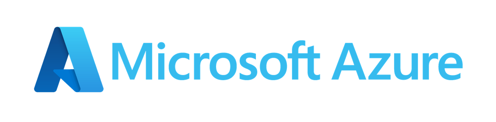

# Azure-IoT-Learn

  

## Table of Contents

1. [Introduction to Cloud Computing](lectures\01_Introduction_to_Cloud_Computing.md)
   
   - Overview of cloud computing concepts and services.

2. [Azure Infrastructure](lectures\02_Azure_infrastructure.md)
   
   - Explanation of Azure's infrastructure components.

3. [Agreements and Pricing](lectures\03_Agreements_and_pricing.md)
   
   - Information about Azure service agreements and pricing models.

4. [Azure Account Creation](labs\01_Account_creation.md)
   
   - Step-by-step guide on creating an Azure account.

5. [Azure Introduction](lectures\04_Azure_resources.md)
   
   - Introduction to various Azure resources architecture, permissions and Cloud Shell.

6. [Azure Blob Storage](lectures\05_Azure_blob.md)
   
   - In-depth exploration of Azure Blob Storage.

7. [Hands-On Lab 01](labs\02_hands_on_lab_01.md)
   
   - Practical exercise about Azure Blobs and Entra ID.

8. [Azure Virtual Networks](lectures\06_Azure_virtual_networks.md)
   
   - Explanation of Azure Virtual Networks.

9. [Azure Virtual Machines](lectures\07_Azure_virtual_machines.md)
   
   - Overview of Azure Virtual Machines.

10. [Hands-On Lab 02](labs\03_hands_on_lab_02.md)
    
    - Practical exercise about Virtual Networks and Virtual Machines.