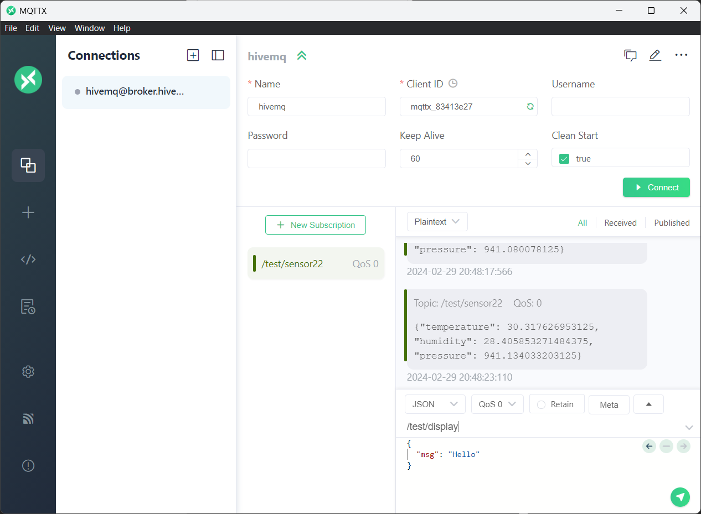

# Hands-on LAB: IoT Practice part 1

## Study Case

**Scenario:** A company is planning to transmit IoT data, such as temperature, humidity, and other sensor readings, via MQTT (Message Queuing Telemetry Transport) with a public broker. The objective is to ensure reliable transmission of IoT data from IoT devices deployed in various locations to a centralized system for analysis and monitoring,

The idea is to set up a Raspberry PI to send this data but the company also want privacy for some cases so they want also to deploy their own MQTT server in Azure.

## Tasks:

**PART 1:** **Public MQTT**

1. Set up the raspberry to recerive and send telemetry data via MQTT.

2. Use a public MQTT broker as HIVEMQ.

3. Use MQTTX to send and receive data in the computer.

**PART 2: Private MQTT**

    1. Set up a Virtual Network.

    2. Launch a Virtual Machine.

    3. Install mosquitto broker.

    4. Modify the NSGs.

    5. Use MQTTX to send and receive data in the computer.

## PART 1: Public MQTT

### Set up the raspberry PI

1. Download the Pi Imager tool and plug the micro sd card to install a O.S.

<p align="center">

</p>

2. After selecting the device and the O.S click on edit settings after clicking next.

<p align="center">

</p>

3. Here some key parts, set a User and a Password and write it down, also configure the Wireless LAN configuration.

<p align="center">

</p>

4. Allow SSH in services to remote access the raspberry PI and click save.

<p align="center">  

</p>

5. Click on YES and wait to finish.

<p align="center">

</p>

6. Identify yout IP address and SSH into the Raspberry PI, you can use Putty or directly Powershell.

Putty link:

```
https://www.chiark.greenend.org.uk/~sgtatham/putty/latest.html
```

<p align="center">

</p>

7. Run the following command to clone the repository with the scripts.

```
git clone -b pre https://github.com/Joseni99/azure-iot-learn.git
```

8. Install the Azure IoT Python SDK, this SDK contains the MQTT library we need.

```
pip install azure-iot-device
```

```
pip install --upgrade typing-extensions
```

9. Try to publish into a MQTT Broker using the broker.py

The idea is to use a public MQTT broker to publish sensor data in a topic1 and suscribe to a topic2 to receive data and print it in the PiHAT.

NOTE: Plase select unique topics or you will collide with other people messages, remember this is a public MQTT broker. Dont close it until you do not want more data from the raspberry, minize it.

        --broker broker
        --topic1 topic2publish
        --topic2 topic2subscribe

```
python azure-iot-learn/broker.py --broker broker.hivemq.com --topic1 /test/sensors --topic2 /test/display
```

10. In your computer install MQTTX and stablish a connection with hivemq:
    
    1. Click on add connection
    
    2. In host change to broker.hivemq.com
    
    3. Click on connect
    
    4. Subscribe to the topic (topic1) you chose for the Raspberry Pi sensor and set the display topic (topic2) to send messages.

<p align="center">

</p>

When publishing use the json format so the script knows which is the message

```
{
  "msg": "Hello"
}
```

Try to play with it using your own mouth and exhale warm air to the sensor, also try to send other messages to the device screen.

## PART 2: Private MQTT

Now with all you have learned, try to deploy your own MQTT broker in Azure.

Here some indications:

- We need a machine to run the MQTT broker, in this case will be Mosquitto. The basic machine B1s will be good enough. Feel free to deploy the VM in any region and use Ubuntu as image. Remember you also have to deploy a VNetwork so you can access the virtual machine.

- Run the following command to install and run Mosquitto broker.
  
  ```
  sudo apt update && sudo apt install -y mosquitto && sudo systemctl start mosquitto
  ```

- Apply the NSGs to allow 1883 port in TCP.

- Run the same command in the Raspberry Pi as in the last part, but this time with your own IP address and topics.
  
  ```
  python azure-iot-learn/broker.py --broker x.x.x.x --topic1 /test/sensors --topic2 /test/display
  ```
  
  NOTE: Do not close it until you do not want more data from the raspberry, minize it.

- Try your own broker in Azure and check if the messages are arriving.
