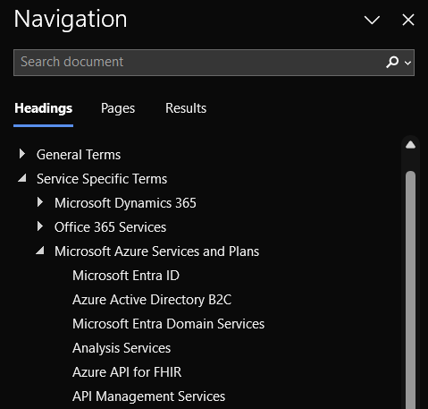
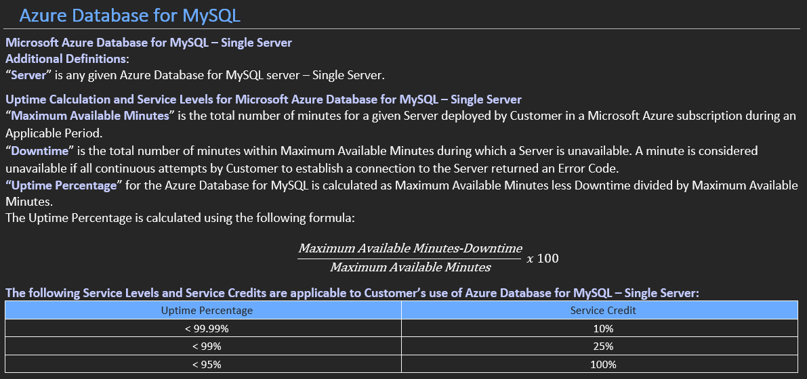
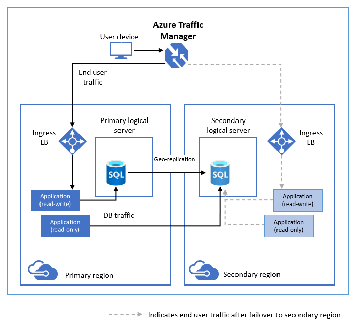

# Service level agreements and Pricing

## Service level agreements

### What is an SLA?

Service Level Agreements, or SLAs, are the backbone of trust between cloud service providers and customers. They define the minimum levels of service a customer can expect and provide a foundation for accountability and reliability.

```
https://www.microsoft.com/licensing/docs/view/Service-Level-Agreements-SLA-for-Online-Services?lang=1
```

&nbsp;

### Azure SLA Overview

Azure's SLAs are comprehensive, covering a wide array of services from virtual machines to storage and networking. By understanding the commitments made by Microsoft in these SLAs, organizations can make informed decisions about service selection based on their specific requirements.

<p align="center">

</p>

&nbsp;

### SLA Metrics

Azure SLAs commonly include metrics such as uptime percentage, response times, and data durability. It's crucial to grasp how these metrics are measured and reported, as this knowledge empowers organizations to assess the performance and reliability of their Azure services.

<p align="center">

</p>

&nbsp;

### Real-world Examples

Let's examine real-world scenarios where adherence to SLAs has been pivotal. Whether it's a critical business application relying on Azure services or a global-scale event stressing cloud infrastructure, understanding how SLAs come into play provides valuable insights into the practical implications of these agreements.

This is an example of an azure architecture with serveral resources, but let's focus only on the Azure SQL databases in this exercise. It doesn't matter that we don't know what a database is, for now we will treat it as a simple service with a contracted agreement.

<p align="center">

</p>

&nbsp;

#### Let's calculate the SLA of a single SQL database:

1. **Azure SQL Database SLA (Single Database):**
   - SLA: 99.99% (Check the documentation refered above.)

The formula for calculating downtime is:

Downtime=(1−SLA)×TotalTime

Downtime=(1−0.9999)×43,200 (1 month in minutes)

Downtime=0.0001×43,200

Downtime=4.32minutes

So, for a single Azure SQL Database with a 99.99% SLA, the allowable downtime in a month is 4.32 minutes.

&nbsp;

#### Let's calculate the SLA of a 2 georedundant SQL database then:

2. **Azure SQL Database with Redundancy (e.g., Geo-Replication):**
   - Assume you have set up geo-replication for your Azure SQL Database to a different region, providing a higher level of redundancy.
   - SLA combined: ? (Check the documentation refered above.)

<details>
<summary>Hidden answer</summary>
Now, let's calculate the allowable downtime for the geo-replicated Azure SQL Database:

Downtime=(1−0.99995)×43,200

Downtime=0.00005×43,200

Downtime=2.16minutes

So, with geo-replication in place, the allowable downtime for the Azure SQL Database improves to 2.16 minutes in a month.

</details>

&nbsp;

## Pricing

Having covered the essentials of Service Level Agreements (SLAs), it's time to dive into the financial aspect of Azure. Azure operates on a pay-as-you-go model, The "Pay-as-You-Go" model in Microsoft Azure refers to a pricing and billing approach where users pay for the cloud services they consume based on actual usage. This model is designed to provide flexibility and cost-effectiveness, especially for businesses and individuals who may have varying workloads or unpredictable resource requirements. 

This makes really hard to calculate the costs of a service because several variables intervene in the operation, but there is a tool provided that will help us with our estimations.

```
https://azure.microsoft.com/en-gb/pricing/calculator/
```

</details>

Now lets do review the steps to calculate the cost of a service in Azure, which in this case is a virtual machine.

&nbsp;

Select Azure Services:
Choose the specific Azure services you plan to use, either by browsing categories or using the search feature.

<p align="center">

</p>

- Configure Services:
  For each selected service, configure parameters such as region, virtual machine type, and storage to match your project's requirements.

- Adjust Usage Details:
  Modify usage details like the number of hours a resource will run, data storage, or transactions processed to reflect your specific needs.

- Review Estimate:
  The calculator provides a real-time estimate as you configure services. Review it to ensure it aligns with your expectations for monthly costs.

<p align="center">

</p>

- Save or Share the Estimate:
  If you have an Azure account, save the estimate for future reference. You can also share it by generating a unique link.

- Export as CSV (Optional):
  Export the estimate as a CSV file if you need documentation or further analysis.

<p align="center">

</p>

Using the Azure Pricing Calculator empowers users to make informed decisions about resource allocation and budgeting before deploying services on the Azure platform. This proactive approach helps in optimizing costs and ensuring efficient resource utilization.
